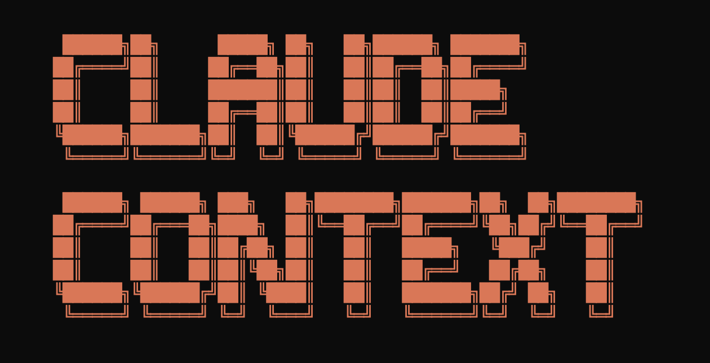

### Your entire codebase as Claude's context

**Claude Context** is an MCP plugin that adds semantic code search to Claude Code and other AI coding agents, giving them deep context from your entire codebase.

🧠 **Your Entire Codebase as Context**: Claude Context uses semantic search to find all relevant code from millions of lines. No multi-round discovery needed. It brings results straight into the Claude's context.

💰 **Cost-Effective for Large Codebases**: Instead of loading entire directories into Claude for every request, which can be very expensive, Claude Context efficiently stores your codebase locally in a vector database and only uses related code in context to keep your costs manageable.

🏠 **Local-First with LanceDB**: By default, Claude Context uses LanceDB for local, embedded vector storage - no external services required. Quick setup with your data staying on your machine.

---

## 🚀 Demo


Model Context Protocol (MCP) allows you to integrate Claude Context with your favorite AI coding assistants, e.g. Claude Code.

## Quick Start
### Prerequisites

**Claude Context works locally by default** - no external vector database needed! Just provide an OpenAI API key for embeddings.

<details>
<summary>Get OpenAI API Key for embedding model</summary>

You need an OpenAI API key for the embedding model. You can get one by signing up at [OpenAI](https://platform.openai.com/api-keys).  

Your API key will look like this: it always starts with `sk-`.  
Copy your key and use it in the configuration examples below as `your-openai-api-key`.

</details>

<details>
<summary>Optional: Use Zilliz Cloud for scalable vector database 👈</summary>

By default, Claude Context uses LanceDB (local, embedded). For larger teams or advanced features, you can optionally use a hosted vector database like Milvus.

### Configure MCP for Claude Code

**System Requirements:**
- Node.js >= 20.0.0 and < 24.0.0
> Claude Context is not compatible with Node.js 24.0.0, you need downgrade it first if your node version is greater or equal to 24.

#### Configuration

Use the command line interface to add the Claude Context MCP server:

```bash
# Add the Claude Context MCP server (uses LanceDB locally by default)
claude mcp add claude-context -e OPENAI_API_KEY=your-openai-api-key -- npx @dannyboy2042/claude-context-mcp@latest

# claude mcp add claude-context -e OPENAI_API_KEY=your-openai-api-key -e VECTOR_DB_TYPE=milvus -e MILVUS_TOKEN=milvus-cloud-api-key -- npx @dannyboy2042/claude-context-mcp@latest
```

See the [Claude Code MCP documentation](https://docs.anthropic.com/en/docs/claude-code/mcp) for more details about MCP server management.


### Other MCP Client Configurations (Gemini CLI, Cursor, Windsurf, etc.)

<details>
<summary><strong>Gemini CLI</strong></summary>

Gemini CLI requires manual configuration through a JSON file:

1. Create or edit the `~/.gemini/settings.json` file.
2. Add the following configuration:

```json
{
  "mcpServers": {
    "claude-context": {
      "command": "npx",
      "args": ["@dannyboy2042/claude-context-mcp@latest"],
      "env": {
        "OPENAI_API_KEY": "your-openai-api-key",
        "MILVUS_TOKEN": "your-milvus-cloud-api-key"
      }
    }
  }
}
```
3. Save the file and restart Gemini CLI to apply the changes.

</details>

<details>
<summary><strong>Qwen Code</strong></summary>

Create or edit the `~/.qwen/settings.json` file and add the following configuration:

```json
{
  "mcpServers": {
    "claude-context": {
      "command": "npx",
      "args": ["@dannyboy2042/claude-context-mcp@latest"],
      "env": {
        "OPENAI_API_KEY": "your-openai-api-key",
        "MILVUS_ADDRESS": "milvus-cloud-public-endpoint",
        "MILVUS_TOKEN": "milvus-cloud-api-key"
      }
    }
  }
}
```

</details>


<details>
<summary><strong>Cursor</strong></summary>

<a href="https://cursor.com/install-mcp?name=claude-context&config=JTdCJTIyY29tbWFuZCUyMiUzQSUyMm5weCUyMC15JTIwJTQwemlsbGl6JTJGY29kZS1jb250ZXh0LW1jcCU0MGxhdGVzdCUyMiUyQyUyMmVudiUyMiUzQSU3QiUyMk9QRU5BSV9BUElfS0VZJTIyJTNBJTIyeW91ci1vcGVuYWktYXBpLWtleSUyMiUyQyUyMk1JTFZVU19BRERSRVNTJTIyJTNBJTIybG9jYWxob3N0JTNBMTk1MzAlMjIlN0QlN0Q%3D"></a>

Go to: `Settings` -> `Cursor Settings` -> `MCP` -> `Add new global MCP server`

Pasting the following configuration into your Cursor `~/.cursor/mcp.json` file is the recommended approach. You may also install in a specific project by creating `.cursor/mcp.json` in your project folder. See [Cursor MCP docs](https://docs.cursor.com/context/model-context-protocol) for more info.

```json
{
  "mcpServers": {
    "claude-context": {
      "command": "npx",
      "args": ["-y", "@dannyboy2042/claude-context-mcp@latest"],
      "env": {
        "OPENAI_API_KEY": "your-openai-api-key",
        "MILVUS_ADDRESS": "milvus-cloud-public-endpoint",
        "MILVUS_TOKEN": "milvus-cloud-api-key"
      }
    }
  }
}
```

</details>

<details>
<summary><strong>Void</strong></summary>

Go to: `Settings` -> `MCP` -> `Add MCP Server`

Add the following configuration to your Void MCP settings:

```json
{
  "mcpServers": {
    "code-context": {
      "command": "npx",
      "args": ["-y", "@dannyboy2042/claude-context-mcp@latest"],
      "env": {
        "OPENAI_API_KEY": "your-openai-api-key",
        "MILVUS_ADDRESS": "milvus-cloud-public-endpoint",
        "MILVUS_TOKEN": "milvus-cloud-api-key"
      }
    }
  }
}
```

</details>

<details>
<summary><strong>Claude Desktop</strong></summary>

Add to your Claude Desktop configuration:

```json
{
  "mcpServers": {
    "claude-context": {
      "command": "npx",
      "args": ["@dannyboy2042/claude-context-mcp@latest"],
      "env": {
        "OPENAI_API_KEY": "your-openai-api-key",
        "MILVUS_ADDRESS": "milvus-cloud-public-endpoint",
        "MILVUS_TOKEN": "milvus-cloud-api-key"
      }
    }
  }
}
```

</details>

<details>
<summary><strong>Windsurf</strong></summary>

Windsurf supports MCP configuration through a JSON file. Add the following configuration to your Windsurf MCP settings:

```json
{
  "mcpServers": {
    "claude-context": {
      "command": "npx",
      "args": ["-y", "@dannyboy2042/claude-context-mcp@latest"],
      "env": {
        "OPENAI_API_KEY": "your-openai-api-key",
        "MILVUS_ADDRESS": "milvus-cloud-public-endpoint",
        "MILVUS_TOKEN": "milvus-cloud-api-key"
      }
    }
  }
}
```

</details>

<details>
<summary><strong>VS Code</strong></summary>

The Claude Context MCP server integrates directly with Claude Code and other MCP-compatible clients:

```json
{
  "mcpServers": {
    "claude-context": {
      "command": "npx",
      "args": ["-y", "@dannyboy2042/claude-context-mcp@latest"],
      "env": {
        "OPENAI_API_KEY": "your-openai-api-key",
        "MILVUS_ADDRESS": "milvus-cloud-public-endpoint",
        "MILVUS_TOKEN": "milvus-cloud-api-key"
      }
    }
  }
}
```

</details>

<details>
<summary><strong>Cherry Studio</strong></summary>

Cherry Studio allows for visual MCP server configuration through its settings interface. While it doesn't directly support manual JSON configuration, you can add a new server via the GUI:

1. Navigate to **Settings → MCP Servers → Add Server**.
2. Fill in the server details:
   - **Name**: `claude-context`
   - **Type**: `STDIO`
   - **Command**: `npx`
   - **Arguments**: `["@dannyboy2042/claude-context-mcp@latest"]`
   - **Environment Variables**:
     - `OPENAI_API_KEY`: `your-openai-api-key`
     - `MILVUS_ADDRESS`: `milvus-cloud-public-endpoint`
     - `MILVUS_TOKEN`: `milvus-cloud-api-key`
3. Save the configuration to activate the server.

</details>

<details>
<summary><strong>Cline</strong></summary>

Cline uses a JSON configuration file to manage MCP servers. To integrate the provided MCP server configuration:

1. Open Cline and click on the **MCP Servers** icon in the top navigation bar.

2. Select the **Installed** tab, then click **Advanced MCP Settings**.

3. In the `cline_mcp_settings.json` file, add the following configuration:

```json
{
  "mcpServers": {
    "claude-context": {
      "command": "npx",
      "args": ["@dannyboy2042/claude-context-mcp@latest"],
      "env": {
        "OPENAI_API_KEY": "your-openai-api-key",
        "MILVUS_ADDRESS": "milvus-cloud-public-endpoint",
        "MILVUS_TOKEN": "milvus-cloud-api-key"
      }
    }
  }
}
```

4. Save the file.

</details>

<details>
<summary><strong>Augment</strong></summary>

To configure Claude Context MCP in Augment Code, you can use either the graphical interface or manual configuration.

#### **A. Using the Augment Code UI**

1. Click the hamburger menu.

2. Select **Settings**.

3. Navigate to the **Tools** section.

4. Click the **+ Add MCP** button.

5. Enter the following command:

   ```
   npx @dannyboy2042/claude-context-mcp@latest
   ```

6. Name the MCP: **Claude Context**.

7. Click the **Add** button.

------

#### **B. Manual Configuration**

1. Press Cmd/Ctrl Shift P or go to the hamburger menu in the Augment panel
2. Select Edit Settings
3. Under Advanced, click Edit in settings.json
4. Add the server configuration to the `mcpServers` array in the `augment.advanced` object

```json
"augment.advanced": { 
  "mcpServers": [ 
    { 
      "name": "claude-context", 
      "command": "npx", 
      "args": ["-y", "@dannyboy2042/claude-context-mcp@latest"],
      "env": {
        "OPENAI_API_KEY": "your-openai-api-key",
        "MILVUS_ADDRESS": "milvus-cloud-public-endpoint",
        "MILVUS_TOKEN": "milvus-cloud-api-key"
      }
    }
  ]
}
```

</details>

<details>
<summary><strong>Roo Code</strong></summary>

Roo Code utilizes a JSON configuration file for MCP servers:

1. Open Roo Code and navigate to **Settings → MCP Servers → Edit Global Config**.

2. In the `mcp_settings.json` file, add the following configuration:

```json
{
  "mcpServers": {
    "claude-context": {
      "command": "npx",
      "args": ["@dannyboy2042/claude-context-mcp@latest"],
      "env": {
        "OPENAI_API_KEY": "your-openai-api-key",
        "MILVUS_ADDRESS": "milvus-cloud-public-endpoint",
        "MILVUS_TOKEN": "milvus-cloud-api-key"
      }
    }
  }
}
```

3. Save the file to activate the server.

</details>


<details>
<summary><strong>Other MCP Clients</strong></summary>

The server uses stdio transport and follows the standard MCP protocol. It can be integrated with any MCP-compatible client by running:

```bash
npx @dannyboy2042/claude-context-mcp@latest
```

</details>

For more detailed MCP environment variable configuration, see our [Environment Variables Guide](docs/getting-started/environment-variables.md).

📚 **Need more help?** Check out our [complete documentation](docs/) for detailed guides and troubleshooting tips.

---


---

## 🏗️ Architecture


### 🔧 Implementation Details

- 🔍 **Hybrid Code Search**: Ask questions like *"find functions that handle user authentication"* and get relevant, context-rich code instantly using advanced hybrid search (BM25 + dense vector).
- 🧠 **Context-Aware**: Discover large codebase, understand how different parts of your codebase relate, even across millions of lines of code.
- ⚡ **Incremental Indexing**: Efficiently re-index only changed files using Merkle trees.
- 🧩 **Intelligent Code Chunking**: Analyze code in Abstract Syntax Trees (AST) for chunking.
- 🗄️ **Scalable**: Integrates with Zilliz Cloud for scalable vector search, no matter how large your codebase is.
- 🛠️ **Customizable**: Configure file extensions, ignore patterns, and embedding models.

### Core Components
Claude Context is a monorepo containing three main packages:

- **`@dannyboy2042/claude-context-core`**: Core indexing engine with embedding and vector database integration
- **`@dannyboy2042/claude-context-mcp`**: Model Context Protocol server for AI agent integration

### Supported Technologies
- **Embedding Providers**: [OpenAI](https://openai.com), [VoyageAI](https://voyageai.com), [Ollama](https://ollama.ai), [Gemini](https://gemini.google.com)
- **Vector Databases**: [LanceDB](https://lancedb.github.io/lancedb/) (default, local), [Milvus](https://milvus.io) or [Zilliz Cloud](https://zilliz.com/cloud) (optional, cloud-based)
- **Code Splitters**: AST-based splitter (with automatic fallback), LangChain character-based splitter
- **Languages**: TypeScript, JavaScript, Python, Java, C++, C#, Go, Rust, PHP, Ruby, Swift, Kotlin, Scala, Markdown
- **Development Tools**: Model Context Protocol, Claude Code

---

## 📦 Other Ways to Use Claude Context

The MCP server is the primary way to use Claude Context with AI assistants like Claude Code.

### Build Applications with Core Package

The `@dannyboy2042/claude-context-core` package provides the fundamental functionality for code indexing and semantic search.

```typescript
import { Context, LanceDBVectorDatabase, OpenAIEmbedding } from '@dannyboy2042/claude-context-core';

// Initialize embedding provider
const embedding = new OpenAIEmbedding({
    apiKey: process.env.OPENAI_API_KEY || 'your-openai-api-key',
    model: 'text-embedding-3-small'
});

// Initialize vector database (LanceDB - local, no setup required)
const vectorDatabase = new LanceDBVectorDatabase({
    uri: './.claude-context/lancedb' // Local storage path
});

// Create context instance
const context = new Context({
    embedding,
    vectorDatabase
});

// Index your codebase with progress tracking
const stats = await context.indexCodebase('./your-project', (progress) => {
    console.log(`${progress.phase} - ${progress.percentage}%`);
});
console.log(`Indexed ${stats.indexedFiles} files, ${stats.totalChunks} chunks`);

// Perform semantic search
const results = await context.semanticSearch('./your-project', 'vector database operations', 5);
results.forEach(result => {
    console.log(`File: ${result.relativePath}:${result.startLine}-${result.endLine}`);
    console.log(`Score: ${(result.score * 100).toFixed(2)}%`);
    console.log(`Content: ${result.content.substring(0, 100)}...`);
});
```

---

## 🛠️ Development

### Setup Development Environment

```bash
# Clone repository
git clone https://github.com/danielbowne/claude-context.git
cd claude-context

# Install dependencies
pnpm install

# Build all packages
pnpm build

# Start development mode
pnpm dev
```

### Building

```bash
# Build all packages
pnpm build

# Build specific package
pnpm build:core
pnpm build:vscode
pnpm build:mcp
```

### Running Examples

```bash
# Development with file watching
cd examples/basic-usage
pnpm dev
```

### Supported File Extensions

By default, Claude Context supports:
- Programming languages: `.ts`, `.tsx`, `.js`, `.jsx`, `.py`, `.java`, `.cpp`, `.c`, `.h`, `.hpp`, `.cs`, `.go`, `.rs`, `.php`, `.rb`, `.swift`, `.kt`, `.scala`, `.m`, `.mm`
- Documentation: `.md`, `.markdown`, `.ipynb`

### Ignore Patterns

Common directories and files are automatically ignored:
- Build outputs: `node_modules/**`, `dist/**`, `build/**`, `out/**`, `target/**`, `coverage/**`, `.nyc_output/**`
- Version control: `.git/**`, `.svn/**`, `.hg/**`
- IDE/Editor files: `.vscode/**`, `.idea/**`, `*.swp`, `*.swo`
- Cache directories: `.cache/**`, `__pycache__/**`, `.pytest_cache/**`
- Logs and temporary: `logs/**`, `tmp/**`, `temp/**`, `*.log`
- Environment files: `.env`, `.env.*`, `*.local`
- Minified/bundled files: `*.min.js`, `*.min.css`, `*.bundle.js`, `*.bundle.css`, `*.chunk.js`, `*.map`

See [FAQ Guide](docs/troubleshooting/faq.md) for detailed and customized configuration of supported file extensions and ignore patterns. 

---

## 📖 Examples

Check the `/examples` directory for complete usage examples:

- **Basic Usage**: Simple indexing and search example

---

## ❓ FAQ

**Common Questions:**

- **[What files does Claude Context decide to embed?](docs/troubleshooting/faq.md#q-what-files-does-claude-context-decide-to-embed)**
- **[Can I use a fully local deployment setup?](docs/troubleshooting/faq.md#q-can-i-use-a-fully-local-deployment-setup)**
- **[Does it support multiple projects / codebases?](docs/troubleshooting/faq.md#q-does-it-support-multiple-projects--codebases)**

For detailed answers and more troubleshooting tips, see our [FAQ Guide](docs/troubleshooting/faq.md).

---

## 🤝 Contributing

We welcome contributions! Please see our [Contributing Guide](CONTRIBUTING.md) for details on how to get started.

**Package-specific contributing guides:**
- [Core Package Contributing](packages/core/CONTRIBUTING.md)
- [MCP Server Contributing](packages/mcp/CONTRIBUTING.md)  

---

## 🗺️ Roadmap

- [x] AST-based code analysis for improved understanding
- [x] Support for additional embedding providers
- [ ] Agent-based interactive search mode
- [x] Enhanced code chunking strategies
- [ ] Search result ranking optimization

---

## 📄 License

This project is licensed under the MIT License - see the [LICENSE](LICENSE) file for details.

---

## 🔗 Links

- [GitHub Repository](https://github.com/danielbowne/claude-context)
- [LanceDB Documentation](https://lancedb.github.io/lancedb/)
- [Milvus Documentation](https://milvus.io/docs)
- [Zilliz Cloud](https://zilliz.com/cloud)

---

## 🙏 Thanks

Special thanks to **Cheney Zhang** and the **Zilliz team** for creating the original Claude Context project. This fork builds upon their excellent foundation to provide a local-first vector database experience with LanceDB.
